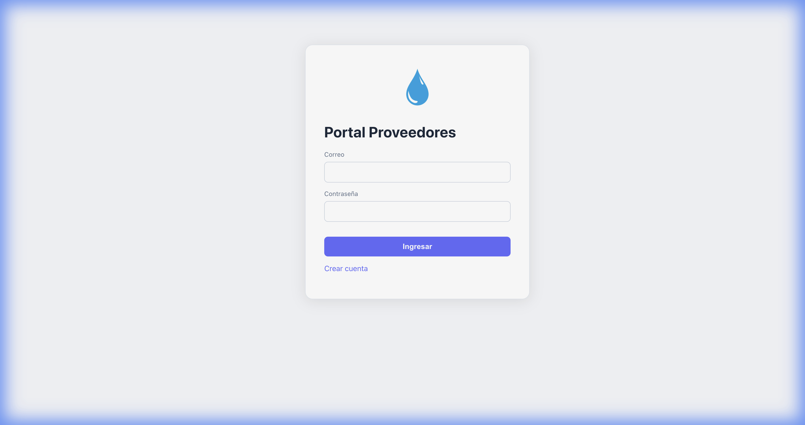
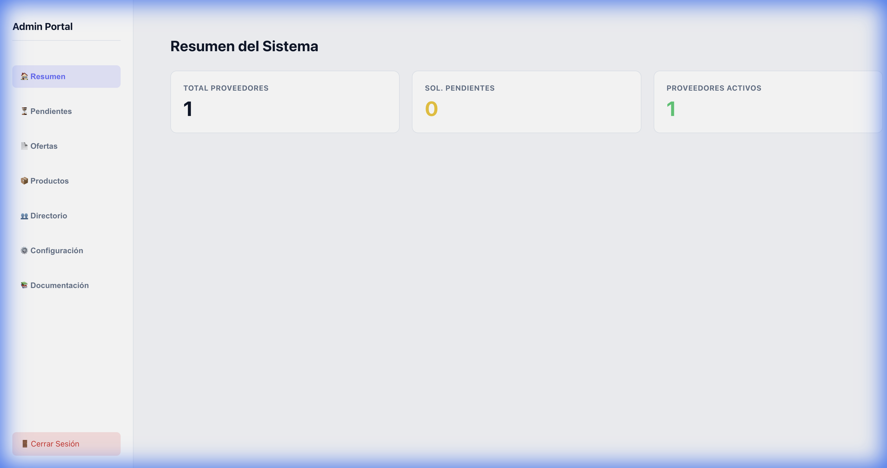
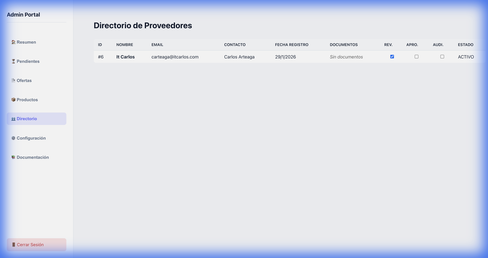
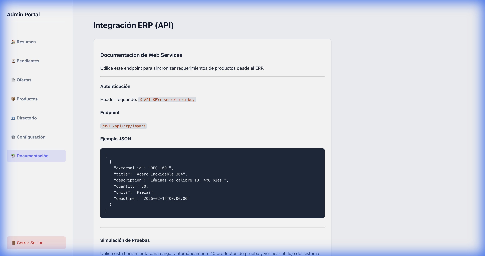
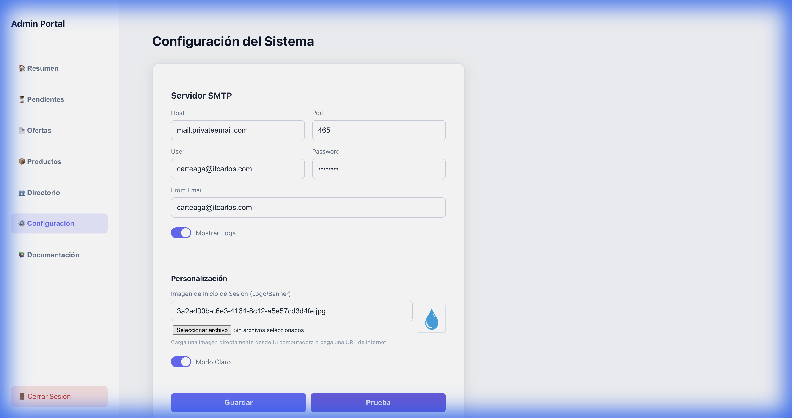

# Portal de Proveedores

Este es un sistema de cotización inversa desarrollado en Rust (Tauri + Actix-web) y React. El portal permite a las empresas gestionar solicitudes de compra y a los proveedores enviar ofertas competitivas de manera ágil.

## Vista Previa del Sistema

### Pantalla de Inicio (Personalizable)


### Panel de Administración - Resumen General


### Gestión de Proveedores (Socios de Negocio)


### Aprobaciones y Cumplimiento


### Integración y Documentación ERP


### Configuración del Sistema (Personalización y SMTP)


## Requisitos Previos

*   Node.js y npm
*   Rust y Cargo
*   Docker (para la base de datos PostgreSQL)
*   Librerías de desarrollo de su sistema operativo para Tauri (Linux: webkit2gtk, etc.)
*   **macOS**: Requiere `libpq` instalado (`brew install libpq` y `brew link --force libpq`).

## Configuración y Ejecución

1.  **Iniciar Base de Datos**:
    ```bash
    docker-compose up -d
    ```
2.  **Instalar Dependencias Frontend**:
    ```bash
    npm install
    ```

3.  **Ejecutar Aplicación (Modo Desarrollo)**:
    Esto iniciará tanto el frontend (Vite) como el backend (Tauri + Actix).
    ```bash
    npm run tauri dev
    ```

4.  **Compilar Binario Único**:
    ```bash
    npm run tauri build
    ```
    El binario resultante estará en `src-tauri/target/release/`.

## API Docs (Para ERP)

El servidor API se inicia en el puerto 8080 por defecto.
*   `POST /api/solicitudes`: Crear solicitud (desde ERP)
*   `GET /api/ofertas/{id}`: Ver ofertas

## Panel de Administración

Para aprobar proveedores pendientes, acceda a:
`http://localhost:1420/admin` (o el puerto configurado por Tauri/Vite).
Desde allí podrá aprobar las cuentas recién registradas para que puedan iniciar sesión.

## Notas
*   Los archivos adjuntos se simulan como rutas de texto en esta versión MVP.
*   La autenticación usa JWT en memoria/localstorage.
*   **Correos**: Se simulan imprimiendo en la consola del backend (stdout).
